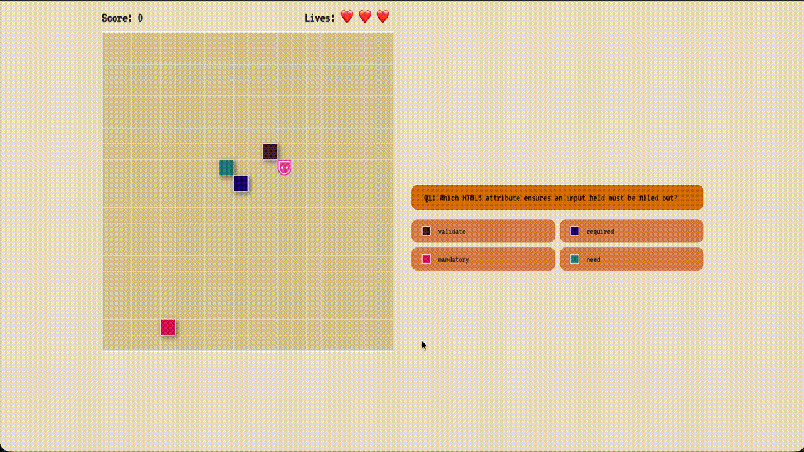
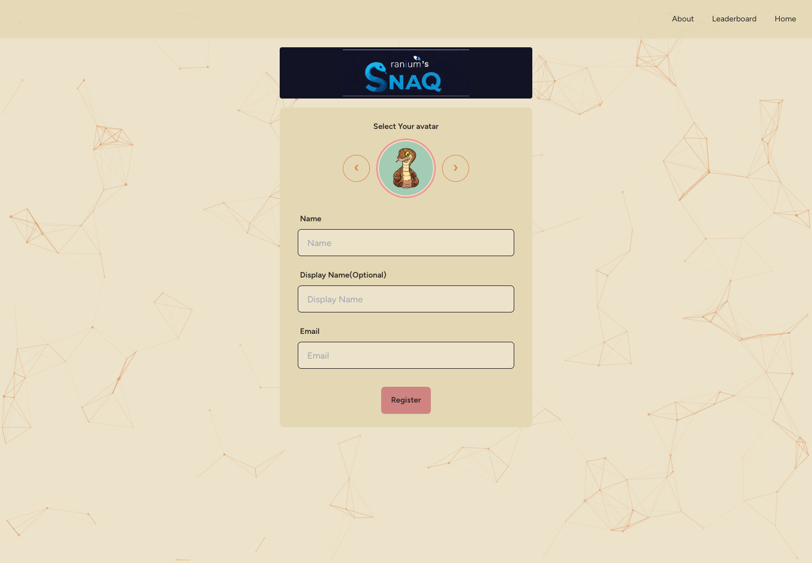
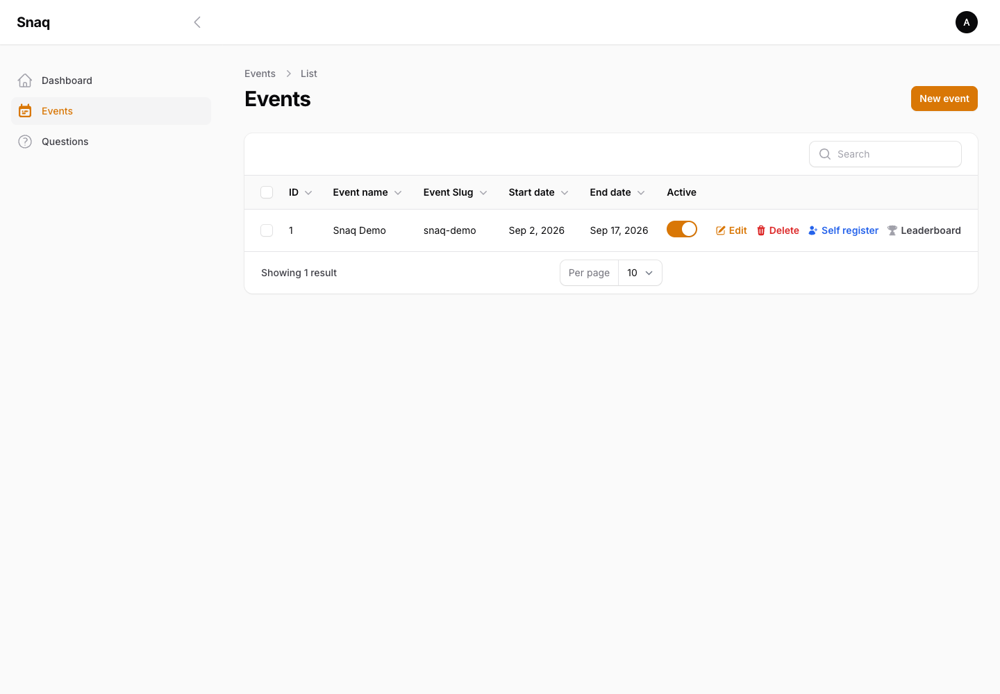

# Snaq

**A fast-paced, event-ready trivia game for curious minds.**

Snaq turns a quiz into a focused live-game experience: players register, choose an avatar, and compete through curated question rounds while organizers manage each event from a dedicated admin panel.

## Gameplay showcase

Snaq pairs real-time snake controls with multiple-choice trivia. Players join an active event, choose an avatar, and steer with the arrow keys to collect the food item representing their answer.





### Rules and scoring

- Each game presents a fixed set of questions across the available difficulty levels.
- Guide the snake to the answer you want to submit; selecting the correct option increases the score and accelerates the snake.
- An incorrect answer deducts points, while colliding with a wall or the snake’s tail costs one of three lives.
- A short cooldown follows every answer, giving players time to read the next question before movement resumes.
- Event settings control replay eligibility, score threshold, leaderboard visibility, registration, and device access.

### Sound effects

Sound is part of the game feedback loop. A countdown starts each session, movement and answer collection have distinct effects, correct and incorrect answers signal point changes, and separate hit, bonus, and game-over effects reinforce pivotal moments.

## Event administration

Create and manage events, configure availability and game settings, maintain the question catalogue, and review players from the Filament admin panel.



## Technology

- Laravel 11, Filament 3, Jetstream, Sanctum, and Eloquent
- Vue 3 with Inertia.js
- Tailwind CSS, DaisyUI, and Vite
- SQLite for the Herd local setup

## Local setup with Laravel Herd

```bash
git clone https://github.com/harshB1709/snaq.git
cd snaq

herd link snaq
herd isolate 8.3
herd composer install
npm ci

cp .env.example .env
touch database/database.sqlite
```

Configure `.env`:

```dotenv
APP_NAME="Snaq"
APP_URL=http://snaq.test
APP_DEBUG=false
DB_CONNECTION=sqlite
DB_DATABASE=/absolute/path/to/snaq/database/database.sqlite
```

Initialize and start:

```bash
herd php artisan key:generate
herd php artisan migrate --seed
herd php artisan storage:link
npm run build
```

Open http://snaq.test. The organizer workspace is available at `/admin`; its seeded development user is defined in `database/seeders/UserSeeder.php`.

## Run an event

1. Sign in to `/admin` and create or edit an active event.
2. Configure event settings such as registration, leaderboard, replay, and mobile access.
3. Add questions to the active question catalogue.
4. Share `/{event-slug}/register` with players.
5. Monitor players and leaderboard results from the admin panel.

## License

MIT
